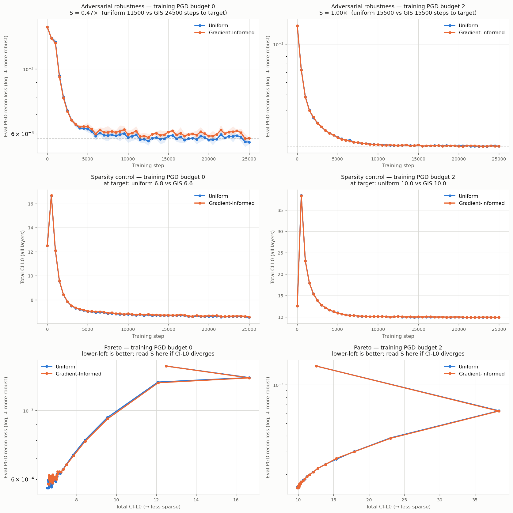
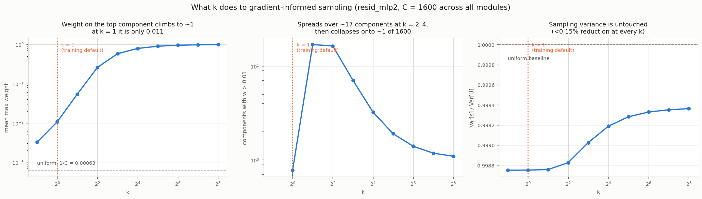

# GIS vs uniform sampling, judged by a PGD adversary

**Status: inconclusive — the experiment ran, but it did not test what it was meant to test.**
GIS was trained at `k = 1`, where it is a ~1% perturbation from uniform sampling. The
headline metric also turned out to be unreliable on this data. Read the caveats before
reusing any number here.

Date: 2026-08-07 · resid_mlp2 · 12 runs · WandB project `spd-gradient-informed-sampling`

---

## The question

Not "can GIS beat PGD" — it can't, and that framing is a category error: PGD *optimises*
a mask over 20 gradient steps while a sampler *draws* one, so the optimiser wins by
construction. Instead:

> Does using GIS as the stochastic sampler during training produce a decomposition that a
> fresh PGD adversary finds harder to break?

PGD is the judge, not the competitor.

## Design

Two arms differing in exactly one config field, `sampling`, crossed with two
training-adversary budgets, 3 seeds each:

| | Arm A | Arm B |
|---|---|---|
| `sampling` | `continuous` (uniform) | `gradient_informed` |
| training `PGDReconSubsetLoss` | `n_steps ∈ {0, 2}` | identical |
| eval `PGDReconLoss` | `init: random, step_size: 0.1, n_steps: 20` | identical |

The `n_steps: 0` arm (no training adversary at all) was included because a strong
adversary can swamp any sampler difference; with no adversary, the sampler is the only
thing shaping the decomposition.

Verified before running that `sampling` is a clean single variable:
`calc_causal_importances` only branches on `sampling` when it is `"binomial"`
(`component_model.py:522`), so `continuous` and `gradient_informed` compute CI
identically. The arms differ only in the mask draw.

## Results



| PGD budget | target | uniform | GIS | S | CI-L0 (u/g) |
|---|---|---|---|---|---|
| 0 | 5.80e-4 | 11500 | 24500 | 0.47 | 6.8 / 6.6 |
| 2 | 1.57e-4 | 15500 | 15500 | 1.00 | 10.0 / 10.0 |

Final eval PGD loss per seed:

| budget | uniform | GIS |
|---|---|---|
| 0 | 5.59, 5.75, 5.53 e-4 | 5.80, 5.83, 5.77 e-4 |
| 2 | 1.57, 1.58, 1.57 e-4 | 1.57, 1.58, 1.57 e-4 |

At budget 0 every GIS seed is worse than every uniform seed — a consistent but **small**
effect, ~3% higher adversarial loss. At budget 2 the arms are indistinguishable
(gap 2.7e-7 vs within-arm std 8.1e-7). CI-L0 is flat across arms, so GIS is not buying or
losing robustness by trading sparsity — the one confound worth controlling for, since
raising `ci` shrinks the `(1 - ci)` factor that is the adversary's only leverage over the
mask (`pgd_utils.py:300`).

## Caveat 1 — the training path hardcodes `k = 1`

`calc_stochastic_component_mask_info` takes `importance_temperature` (default `1.0`,
`component_utils.py:23`), but **no metric ever passes it**. `StochasticReconSubsetLoss`
calls it without the argument (`stochastic_recon_subset_loss.py:35-41`). So all 12 runs
used `k = 1`.

The earlier sweep in `run_local_sweep_sampler_k_resid_mlp2.py` does vary `k`, but it
passes it to `run_sampler_benchmark` — the *frozen-model probe*, not training. **`k` has
never been tested as a training signal.**



Measured on real gradients (`C = 1600` across all four modules, uniform weight
`1/C = 0.00063`):

| k | max w | components with w > 0.01 | Var[s]/Var[U] |
|---|---|---|---|
| 0.5 | 0.0032 | 0.0 | 0.9988 |
| **1** | **0.0107** | **0.8** | **0.9988** |
| 2 | 0.0541 | 16.9 | 0.9988 |
| 4 | 0.2585 | 16.3 | 0.9988 |
| 8 | 0.5782 | 7.1 | 0.9990 |
| 16 | 0.7863 | 3.2 | 0.9992 |
| 32 | 0.8954 | 1.9 | 0.9993 |
| 64 | 0.9482 | 1.4 | 0.9993 |
| 256 | 0.9867 | 1.1 | 0.9994 |

At `k = 1` the largest weight any component receives is 0.011, so `s = (1 - w)·U ≥ 0.989·U`
— GIS is within ~1% of uniform everywhere. That a ~1% perturbation produced a ~3%
robustness difference is possible but weakly supported; more likely the runs mostly
measured seed variance.

`k` has three qualitatively distinct regimes, and only the first was tested:

- `k ≲ 1`: indistinguishable from uniform
- `k = 2–4`: weight spread over ~17 components
- `k ≳ 32`: collapses onto ~1 component, hard-ablated, all others exactly uniform

## Caveat 2 — `S` is unreliable on this data

`S = steps_uniform(target) / steps_GIS(target)` reads a crossing time off the loss curve.
Both arms plateau by ~5000 steps and then sit flat and noisy for 20000 more, so the
crossing time is dominated by noise. Control — computing `S` between two **uniform** seeds,
which should be 1.0 by construction:

| budget | seeds 0v1 | seeds 0v2 | seeds 1v2 |
|---|---|---|---|
| 0 | 0.74 | 2.20 | 2.25 |
| 2 | 1.12 | 1.15 | 0.81 |

The noise floor spans roughly 0.7–2.3. **`S = 0.47` is barely outside it and should not be
read as "2× worse."** Compare final losses with seed separation instead — that's the
column that actually shows the consistent (if small) budget-0 effect.

## Discredited explanation

An earlier hypothesis was that GIS collapses sampling variance — trading exploration for
targeting — and that the adversary exploits the unvisited regions. **This is wrong.**
`Var[s]/Var[U] = E[(1-w)²]` is ≥ 0.9988 at every `k` from 0.5 to 256: GIS reduces sampling
variance by less than 0.15% no matter how it is tuned, because weight concentrates on a
handful of 1600 components while the rest stay exactly uniform. Whatever GIS does or
doesn't do, variance is not the mechanism.

## What would make this conclusive

1. Plumb `importance_temperature` through the loss configs into
   `calc_stochastic_component_mask_info` — currently a dead parameter on the training path.
2. Re-run at budget 0 only (budget 2 demonstrably swamps the sampler) with
   `k ∈ {1, 4, 32}`, spanning the three regimes. ~6 runs × 40 min.
3. Report final adversarial loss with per-seed values, not `S`. If a crossing-time metric
   is wanted, define the target off the *steep* part of the curve, not the plateau.
4. More seeds — with n=3 and a ~3% effect, this is underpowered.

## Relationship to the earlier result

The `benchmark_sampler.py` finding — GIS draws harder single masks than uniform against a
frozen model — is not contradicted. That measured the sampler as a *probe*; this measured
it as a *training signal*. Those are different claims, and nothing here shows the first one
transfers to the second. It also doesn't show it fails to, because of Caveat 1.

## Reproducing

```bash
source .venv/bin/activate

# 12 training runs, ~40 min each; one subprocess per arm, filters allow resuming
python spd/scripts/run_local_grid_gis_vs_uniform_resid_mlp2.py

# headline table + pgd_robustness_grid.png
python spd/scripts/analyze_gis_vs_uniform_grid.py --entity <wandb_entity>

# gis_temperature.png; no training required, runs in ~1 min
python spd/scripts/diagnose_gis_temperature.py --out gis_temperature.png
```

| file | role |
|---|---|
| `spd/experiments/resid_mlp/resid_mlp2_gis_grid_config.yaml` | base config; eval PGD is the instrument, `0.1 / 20` |
| `spd/scripts/run_local_grid_gis_vs_uniform_resid_mlp2.py` | builds and runs the 12 arms |
| `spd/scripts/analyze_gis_vs_uniform_grid.py` | pulls WandB, computes `S`, plots the grid |
| `spd/scripts/diagnose_gis_temperature.py` | what `k` does to the weights; no runs needed |

Timings on this box: ~0.054 s/training step, ~17.3 s per eval (100 batches × 20-step PGD),
51 evals per run.
